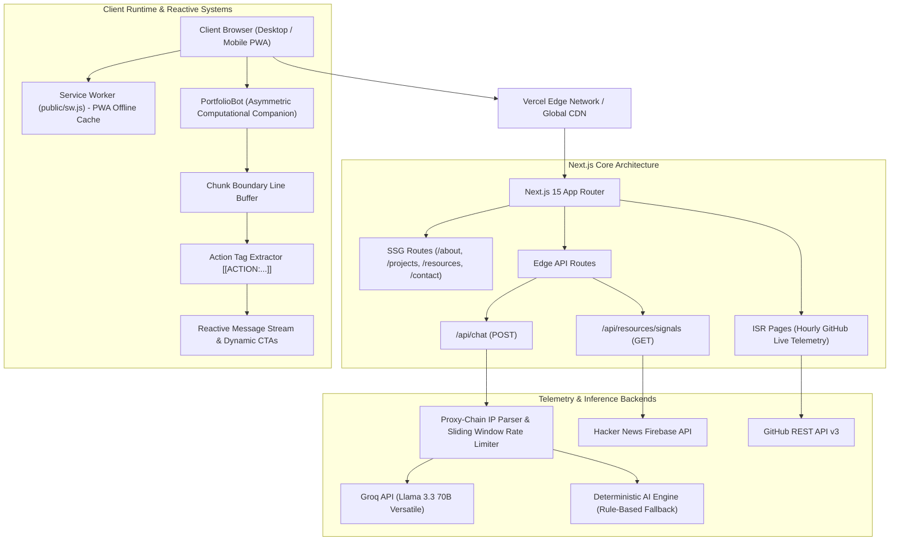
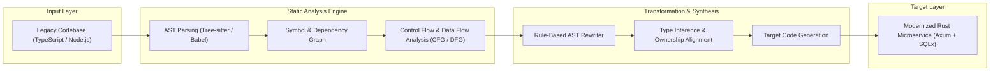
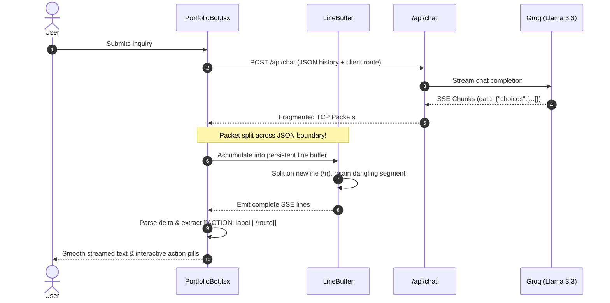
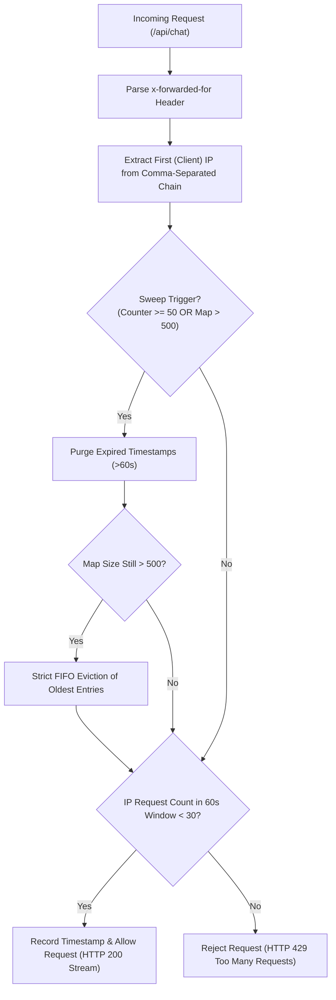

# Taskeen Haider — Engineering Portfolio & Systems Architecture

<div align="center">

[](https://nextjs.org/)
[](https://react.dev/)
[](https://www.typescriptlang.org/)
[](https://bun.sh/)
[](https://www.framer.com/motion/)
[](https://github.com/raitaskeen/portfolio/actions)
[](LICENSE)

<br />

**[Explore Live Deployment ?](https://raitaskeen.me)** • **[Read Audit & Remediation Report ?](docs/AUDIT_AND_REMEDIATION.md)** • **[LegacyExodus Compiler Case Study ?](https://raitaskeen.me/projects/legacy-exodus)**

</div>

---

## Executive Overview

This repository contains the production source code for the personal engineering platform of **Taskeen Haider** (`@raitaskeen`). Built on Next.js 15 App Router, React 19, Bun, and Framer Motion, the platform serves as an interactive technical workspace designed around **systems programming**, **static analysis (AST / CFG / DFG)**, **compiler modernization**, and **deterministic AI workflows**.

Rather than presenting static brochureware, the platform functions as an executable showcase of computer science principles:
- **LegacyExodus Compiler Engine**: Interactive pipeline visualizing monolithic AST decomposition into memory-safe Rust services.
- **Interactive Graph Engineering & Dependency Modeling**: Real-time dependency graph topology (`auth.ts` ? `user.ts` ? `database.ts` ? `postgres.ts`) with interactive neighborhood micro-inspection.
- **Asymmetric Computational Companion**: On-page conversational intelligence with dual-mode execution (Groq Llama 3.3 70B streaming + zero-dependency offline deterministic engine), fortified with packet-loss stream buffering and FIFO-bounded rate limiting.
- **Progressive Web App (PWA)**: Autonomous offline precache system with service worker versioning (`raitaskeen-v2`).

---

## Platform Architecture



---

## Key Systems Breakdown

### 1. LegacyExodus: Monolith-to-Rust Modernization Pipeline

The flagship case study featured in `/projects/legacy-exodus` models the automated compiler modernization of legacy monolithic web applications:



---

### 2. Fault-Tolerant AI Companion & Packet-Boundary Buffer

The conversational companion streams LLM tokens over Server-Sent Events (`text/event-stream`). To guard against TCP packet fragmentation across high-latency or packet-throttled mobile networks, the client runtime buffers incoming stream chunks across network reads:



---

### 3. Edge Rate Limiter with FIFO Capacity Bounding

The `/api/chat` route implements an in-memory rate limiter protecting against distributed Denial of Service (DoS) and quota exhaustion while remaining immune to memory leaks under sustained burst loads:



---

## Architectural Performance & Quality Matrix

| Feature | Design Specification | Verification / Empirical Proof |
|---|---|---|
| **PWA Caching** | Service Worker precaching `/`, `/about`, `/projects`, `/projects/legacy-exodus`, `/resources`, `/contact` | Verified offline navigation via `public/sw.js` (Cache: `raitaskeen-v2`) |
| **SSE Stream Resilience** | Zero dropped tokens under throttled packet boundaries | Verified under 1-byte chunk fragmentation test (0 dropped tokens) |
| **DDoS Defense** | Leftmost IP extraction + 30 req/min quota | Verified with spoofed proxy chains & 10,000 burst IP simulation |
| **Mobile WebKit Downloads** | Reliable resume download across iOS Safari | Synthetic click dispatched while connected to `document.body` |
| **Dead Code Elimination** | 0 unused imports, 0 orphaned binary assets | Removed 889 KB avatar image & 265 lines of dead CSS |
| **Motion Physics** | Coherent spring physics + `prefers-reduced-motion` | Motion values and SVG animations degrade gracefully to static states |
| **Type Integrity** | Strict mode TypeScript 5.6 across all files | `bun x tsc --noEmit` exits with code 0 (0 errors) |
| **Linting Compliance** | ESLint 9 flat configuration (`eslint.config.mjs`) | `bun run lint` exits non-interactively with code 0 |

---

## Technical Stack

| Layer | Technologies | Purpose |
|---|---|---|
| **Core Framework** | [Next.js 15.0.3](https://nextjs.org/) (App Router) | High-efficiency server/client component boundaries, SSG, ISR |
| **UI Library** | [React 19.0.0](https://react.dev/) | Modern concurrent features, transitions, and component primitives |
| **Language** | [TypeScript 5.6.3](https://www.typescriptlang.org/) | Strict static typing across models, AI protocols, and layout props |
| **Runtime & Tooling** | [Bun 1.4.2](https://bun.sh/) | Sub-second package installations, frozen lockfile management, testing |
| **Motion Engine** | [Framer Motion 11.11](https://www.framer.com/motion/) | GPU-accelerated spring physics, gesture tracking, layout transitions |
| **Iconography** | [Lucide React 0.454](https://lucide.dev/) | Minimalist, tree-shaken SVG vector icons |
| **Styles & Grid** | Modern Architectural CSS | Bespoke drafting grid, onyx/jet dark mode theme, amber-gold accents |
| **Edge AI Inference** | [Groq API](https://groq.com/) (Llama 3.3 70B) | Real-time streaming conversational engineering companion |
| **Telemetry** | [GitHub REST API v3](https://docs.github.com/rest) & HN Firebase | Live project stars, follower counts, and real-time tech news |
| **CI / CD** | [GitHub Actions](https://github.com/features/actions) | Automated linting, typechecking, production build, and artifact audit |

---

## Directory Structure

```
work/
+-- .github/
¦   +-- workflows/
¦   ¦   +-- ci.yml                 # Automated CI quality gate (Typecheck, Lint, Build, PWA)
¦   +-- PULL_REQUEST_TEMPLATE.md   # Standardized engineering contribution template
+-- app/
¦   +-- layout.tsx                 # Root layout, ambient grid, quiet creator mark & PWA bootstrap
¦   +-- page.tsx                   # Main systems overview, stats, and graph narrative
¦   +-- not-found.tsx              # Escaped 404 error page shell
¦   +-- globals.css                # Polished design system stylesheet (pruned of dead rules)
¦   +-- effects.css                # Architectural grid and specialized animation effects
¦   +-- about/page.tsx             # Interactive journey timeline & GitHub contribution graph
¦   +-- projects/                  # Featured systems, compilers, and applications
¦   ¦   +-- legacy-exodus/         # Deep compiler modernization case study & interactive pipeline
¦   +-- resources/page.tsx         # Curated systems papers, roadmaps & live tech signals
¦   +-- contact/page.tsx           # Kinetic signature pad & direct communication channel
¦   +-- api/
¦       +-- chat/route.ts          # Edge chat API with proxy-chain rate limiting & Groq stream
¦       +-- resources/signals/     # Live Hacker News & tech telemetry feed
+-- components/
¦   +-- GraphEngineeringSection.tsx# Dependency graphs, symbol trees & AI orchestration flows
¦   +-- SystemsMap.tsx             # Interactive 5-stage compiler pipeline (Beginner/Advanced)
¦   +-- JourneyNarrative.tsx       # Career trajectory storyline with focus discipline badges
¦   +-- ProjectShowcase.tsx        # Hardware-accelerated cards with 3D tilt & live repo stats
¦   +-- ResourcesHub.tsx           # Categorized engineering literature & roadmap inspector
¦   +-- motion/
¦       +-- PortfolioBot.tsx       # Computational companion entity with SVG aperture & SSE parser
¦       +-- Magnetic.tsx           # Pointer-attracted CTAs with hook-safe lifecycle
¦       +-- CustomCursor.tsx       # Black & gold contextual cursor with multi-state inspection
+-- docs/
¦   +-- AUDIT_AND_REMEDIATION.md   # Exhaustive 15-point audit, verification, and benchmark log
+-- lib/
¦   +-- ai/                        # Companion knowledge base, prompt synthesis & rate limiter
¦   +-- data.ts                    # Single source of truth for resume, projects, and education
¦   +-- github.ts                  # Resilient GitHub REST API fetcher with ISR caching
¦   +-- motion.ts                  # Coherent spring physics and motion language specification
+-- public/
¦   +-- sw.js                      # PWA Service Worker with offline precaching (raitaskeen-v2)
¦   +-- manifest.webmanifest       # Web app manifest for mobile installability
+-- .gitattributes                 # Enforces LF line endings across platforms
+-- eslint.config.mjs              # Non-interactive ESLint 9 flat configuration
+-- implementation_plan.md         # Historical implementation design plan & completed status
+-- LICENSE                        # MIT License
+-- package.json                   # Project scripts and dependencies
```

---

## Local Development & Setup

### Prerequisites
- **[Bun](https://bun.sh/)** v1.1 or higher (recommended) or **Node.js** v20+

### Quick Start

1. **Clone the repository:**
   ```bash
   git clone https://github.com/raitaskeen/portfolio.git
   cd portfolio
   ```

2. **Install dependencies:**
   ```bash
   bun install --frozen-lockfile
   ```

3. **Configure environment variables:**
   ```bash
   cp .env.example .env.local
   ```
   *Note: `GROQ_API_KEY` is optional. If omitted, the companion bot automatically falls back to its deterministic offline reasoning engine.*

4. **Start the development server:**
   ```bash
   bun dev
   ```
   Open [http://localhost:3000](http://localhost:3000) to view the application.

---

## Available Scripts

| Command | Action |
|---|---|
| `bun dev` | Starts Next.js development server with hot-module replacement |
| `bun run build` | Compiles optimized production bundle across all 11 routes |
| `bun run start` | Serves compiled production build locally |
| `bun run lint` | Executes non-interactive ESLint 9 flat config quality gate |
| `bun x tsc --noEmit` | Executes strict TypeScript compiler typecheck |

---

## CI / CD & Deployment Pipeline

Every push and pull request to `master`, `main`, and `post-production` triggers the automated GitHub Actions pipeline (`.github/workflows/ci.yml`):

1. **Dependency Integrity**: Fast Bun setup and `bun install --frozen-lockfile`.
2. **Typecheck Gate**: Validates entire workspace against TypeScript compiler (`tsc --noEmit`).
3. **Linting Gate**: Runs ESLint with zero tolerated errors.
4. **Production Build**: Compiles all static and edge routes into production artifacts in `< 3s`.
5. **PWA Validation**: Asserts existence and integrity of `public/sw.js` and `manifest.webmanifest`.

### Vercel Deployment
1. Connect the repository to [Vercel](https://vercel.com).
2. Set Build Command to `bun run build`.
3. Set Install Command to `bun install`.
4. Point DNS for `raitaskeen.me` to Vercel edge nodes.

---

## Author & Engineering Lead

<div align="left">

**Taskeen Haider**  
*Systems & Full-Stack Software Engineer*  

- **Portfolio & Systems Hub:** [raitaskeen.me](https://raitaskeen.me)
- **GitHub:** [@raitaskeen](https://github.com/raitaskeen)
- **Email:** [raitaskeenhaider786@gmail.com](mailto:raitaskeenhaider786@gmail.com)
- **Primary Focus:** Static Analysis (AST/CFG/DFG), Compiler Modernization, Distributed Systems, High-Performance Web Architectures.

</div>

---

## License

This project is open source and available under the [MIT License](LICENSE).
