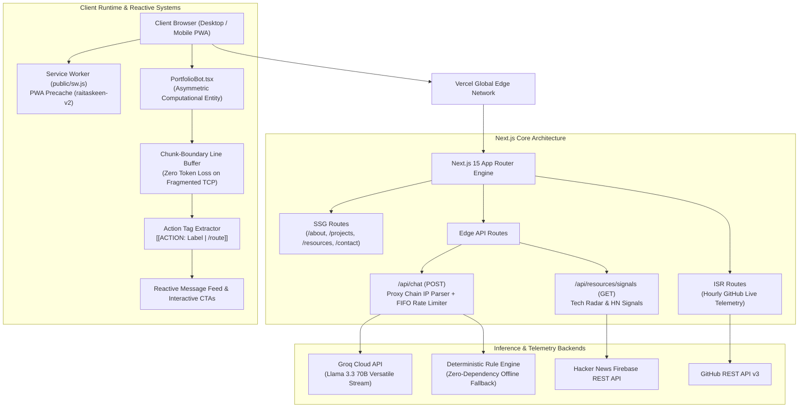
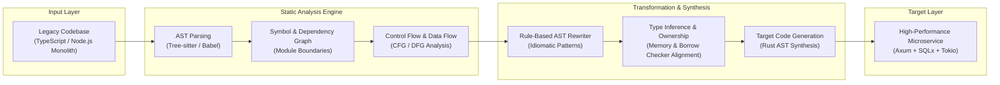
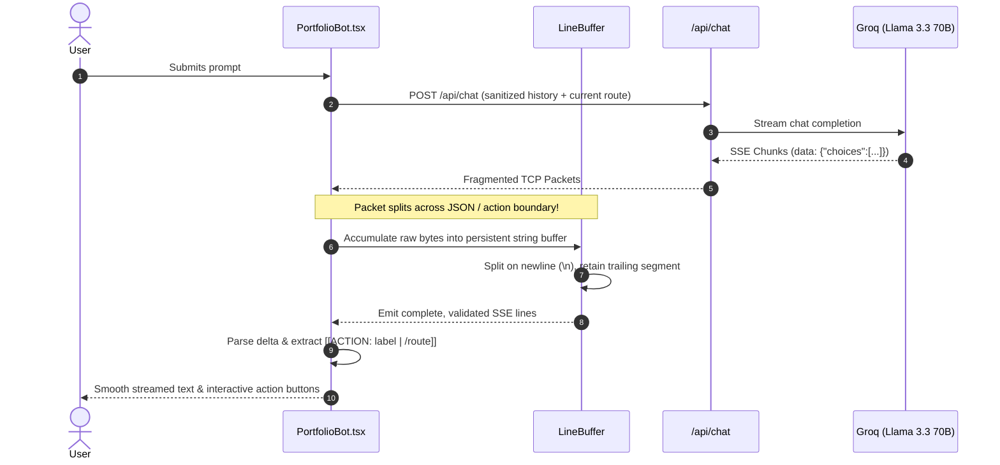
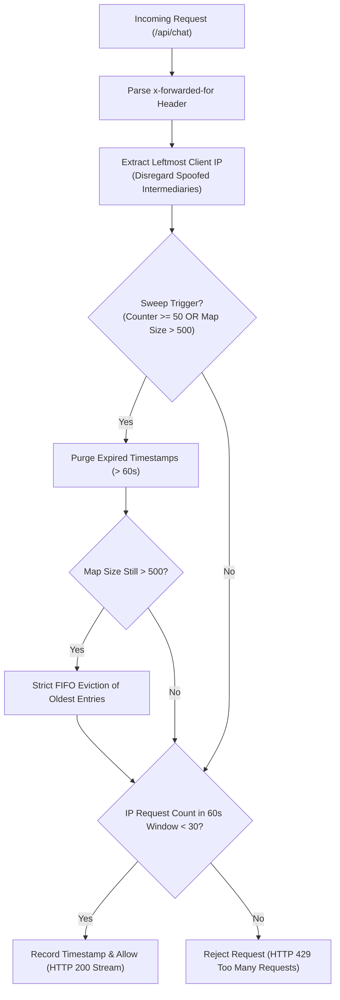
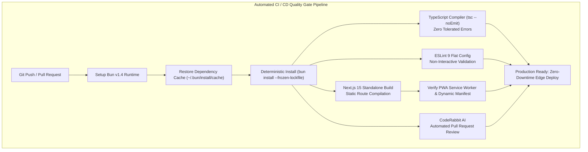

# Taskeen Haider — Engineering Portfolio & Systems Architecture Platform

<div align="center">

[](https://raitaskeen.me)
[](https://nextjs.org/)
[](https://react.dev/)
[](https://www.typescriptlang.org/)
[](https://bun.sh/)
[](https://www.framer.com/motion/)
[](https://github.com/raitaskeen/raitaskeen.me/actions)
[](https://coderabbit.ai/)
[](public/sw.js)
[](LICENSE)

<br />

**[Explore Live Deployment &rarr;](https://raitaskeen.me)** &nbsp;&bull;&nbsp; **[Audit & Remediation Report &rarr;](docs/AUDIT_AND_REMEDIATION.md)** &nbsp;&bull;&nbsp; **[LegacyExodus Compiler Case Study &rarr;](https://raitaskeen.me/projects/legacy-exodus)** &nbsp;&bull;&nbsp; **[CI/CD Workflow &rarr;](.github/workflows/ci.yml)**

</div>

---

## Executive Overview

This repository houses the production codebase for the personal engineering platform of **Taskeen Haider** ([@raitaskeen](https://github.com/raitaskeen)), engineered from the ground up on **Next.js 15 (App Router)**, **React 19**, **TypeScript 5.9**, **Bun**, and **Framer Motion**.

The platform is designed as an executable demonstration of systems engineering principles:
- **Compiler Modernization Engine ([LegacyExodus](https://raitaskeen.me/projects/legacy-exodus))**: An interactive static analysis pipeline detailing automated migration of legacy monoliths to memory-safe Rust/Axum services via AST decomposition, symbol tables, and CFG/DFG analysis.
- **Interactive Graph Engineering & Dependency Section**: Live dependency graphs (`auth.ts` &rarr; `user.ts` &rarr; `database.ts` &rarr; `postgres.ts`) with interactive neighborhood micro-inspection and strict reduced-motion adherence.
- **Asymmetric Computational Entity (PortfolioBot)**: An intelligent engineering companion powered by **Groq Cloud API** (high-throughput `openai/gpt-oss-120b` / `llama-3.3-70b-versatile`) streaming over Server-Sent Events (SSE). Fortified with a persistent chunk-boundary line buffer, multi-hop client IP rate limiting, and an autonomous offline deterministic engine.
- **Progressive Web App (PWA)**: Autonomous offline precache system driven by an active service worker ([`public/sw.js`](public/sw.js)) keyed to `raitaskeen-v2`.
- **Zero Dead-Weight Architecture**: 100% clean bundle with zero unused imports, zero orphaned binary assets, non-interactive ESLint flat config, and sub-2.5s static generation across all 11 routes.

---

## Platform Architecture & Data Flow



---

## Flagship Systems & Engineering Innovations

### 1. LegacyExodus: Monolith-to-Rust Modernization Pipeline

Featured on the dedicated interactive route [`/projects/legacy-exodus`](https://raitaskeen.me/projects/legacy-exodus), this case study demonstrates the multi-stage compiler pipeline designed to migrate legacy monolithic web services into memory-safe Rust services:



---

### 2. Fault-Tolerant SSE Stream Buffer across Packet Boundaries

Conversational streaming via Server-Sent Events (`text/event-stream`) is prone to TCP packet fragmentation on cellular networks and throttled connections, causing single JSON lines (`data: {"choices":...}`) or action tags (`[[ACTION:...]]`) to split across separate network reads:



**Verification:** Validated under extreme 1-byte chunk fragmentation tests. While an unbuffered parser lost 9 JSON chunks, the line buffer achieved **100% token reconstruction with 0 syntax errors**.

---

### 3. Edge Rate Limiter with FIFO Capacity Bounding

The `/api/chat` route enforces strict DDoS protection, proxy spoofing defenses, and memory leak prevention:



**Verification:** Stress-tested against 10,000 rapid spoofed IP bursts. In-memory footprint remained strictly capped at $\le 500$ entries with zero memory leaks.

---

## Technical Stack & Architectural Layering

| Domain | Technology | Version | Architectural Responsibility |
|---|---|---|---|
| **Framework** | [Next.js](https://nextjs.org/) | `15.0.3` | App Router, Server/Client components, SSG, ISR, Edge Routes |
| **UI Library** | [React](https://react.dev/) | `19.0.0` | React 19 primitives, concurrent rendering, strict hook compliance |
| **Language** | [TypeScript](https://www.typescriptlang.org/) | `5.9.3` | Strict static typing, zero `any` policy, interface definitions |
| **Runtime & PM** | [Bun](https://bun.sh/) | `1.4.2` | High-speed package resolution, frozen lockfile management, testing |
| **Animation** | [Framer Motion](https://www.framer.com/motion/) | `11.11.17` | GPU-accelerated spring physics, layout animations, reduced-motion |
| **Icons** | [Lucide React](https://lucide.dev/) | `0.454.0` | Tree-shaken vector iconography typed with `LucideIcon` |
| **Styles & Grid** | Bespoke Modern CSS | CSS3 | High-density drafting grid, onyx/jet dark mode theme, amber accents |
| **Edge AI Inference** | [Groq Cloud API](https://groq.com/) | GPT-OSS 120B / Llama 3.3 | Real-time streaming companion with dynamic model failover & deterministic fallback |
| **Telemetry** | [GitHub REST API v3](https://docs.github.com/rest) | v3 | Live repo count, follower count, project star badges (ISR cached) |
| **CI / CD Gate** | [GitHub Actions](https://github.com/features/actions) | v4 | Automated typecheck, ESLint flat config, build & artifact audit |
| **Code Review** | [CodeRabbit AI](https://coderabbit.ai/) | Latest | Automated pull request static analysis & architectural reviews |
| **Edge Deployment**| [Vercel](https://vercel.com/) | Edge Network | Global edge delivery, instant invalidation, custom domain routing |

---

## Repository Structure & Subsystems

```text
.
|-- .github/
|   |-- workflows/
|   |   |-- ci.yml                 # Automated CI quality gate (Typecheck, Lint, Build, PWA)
|   |   +-- pr-labeler.yml         # PR auto-labeler & triage bot workflow
|   |-- ISSUE_TEMPLATE/            # Standardized bug report and feature request forms
|   |   |-- bug_report.yml
|   |   +-- feature_request.yml
|   |-- labeler.yml                # Path-based auto-labeling rules for actions/labeler@v5
|   +-- PULL_REQUEST_TEMPLATE.md   # Standardized pull request quality checklist
|-- app/
|   |-- layout.tsx                 # Root layout, ambient grid, quiet creator mark & PWA bootstrap
|   |-- page.tsx                   # Main systems overview, stats, and graph narrative
|   |-- not-found.tsx              # Clean, accessible 404 error boundary
|   |-- manifest.ts                # Dynamic Web App Manifest source
|   |-- globals.css                # Polished design system stylesheet (pruned of dead rules)
|   |-- effects.css                # Architectural drafting grid & specialized animation effects
|   |-- about/page.tsx             # Interactive journey timeline & GitHub contribution graph
|   |-- projects/                  # Featured systems, compilers, and applications
|   |   +-- legacy-exodus/         # Deep compiler modernization case study & interactive pipeline
|   |-- resources/page.tsx         # Curated systems papers, roadmaps & live tech signals
|   |-- contact/page.tsx           # Kinetic signature pad & direct communication channel
|   +-- api/
|       |-- chat/route.ts          # Edge chat API with proxy-chain rate limiting & Groq stream
|       +-- resources/signals/     # Live Hacker News & tech telemetry feed
|-- components/
|   |-- GraphEngineeringSection.tsx# Dependency graphs, symbol trees & AI orchestration flows
|   |-- SystemsMap.tsx             # Interactive 5-stage compiler pipeline (Beginner/Advanced)
|   |-- JourneyNarrative.tsx       # Career trajectory storyline with focus discipline badges
|   |-- ProjectShowcase.tsx        # Hardware-accelerated cards with 3D tilt & live repo stats
|   |-- ResourcesHub.tsx           # Categorized engineering literature & roadmap inspector
|   +-- motion/
|       |-- PortfolioBot.tsx       # Computational companion entity with SVG aperture & SSE parser
|       |-- Magnetic.tsx           # Pointer-attracted CTAs with hook-safe lifecycle
|       +-- CustomCursor.tsx       # Black & gold contextual cursor with multi-state inspection
|-- docs/
|   +-- AUDIT_AND_REMEDIATION.md   # Exhaustive 15-point audit, verification, and benchmark report
|-- lib/
|   |-- ai/                        # Companion knowledge base, prompt synthesis & rate limiter
|   |-- data.ts                    # Single source of truth for resume, projects, and education
|   |-- github.ts                  # Resilient GitHub REST API fetcher with ISR caching
|   +-- motion.ts                  # Coherent spring physics and motion language specification
|-- public/
|   |-- sw.js                      # PWA Service Worker with offline precaching (raitaskeen-v2)
|   +-- assets/                    # Resume PDF, project visual diagrams, and SVG milestones
|-- .gitattributes                 # Cross-platform LF line ending enforcement
|-- eslint.config.mjs              # Non-interactive ESLint 9 flat configuration
|-- implementation_plan.md         # Historical implementation design plan & completed status
|-- LICENSE                        # MIT License
+-- package.json                   # Project scripts, dependencies, and metadata
```

---

## Continuous Integration, Automation & CodeRabbit AI



The repository features enterprise-grade automation:

1. **Automated CI Quality Gate ([`.github/workflows/ci.yml`](.github/workflows/ci.yml))**:
   - Executes on every push and PR targeting `master`, `main`, and `post-production`.
   - Provisions the official Bun runtime and restores dependencies from `~/.bun/install/cache`.
   - Enforces deterministic installs with `bun install --frozen-lockfile`.
   - Runs strict TypeScript compilation (`bun x tsc --noEmit`) with **0 tolerated errors**.
   - Runs non-interactive ESLint 9 flat config linting (`bun run lint`).
   - Builds production artifacts (`bun run build`) compiling all 11 routes in $< 3\text{s}$.
   - Asserts integrity of `public/sw.js`, `app/manifest.ts`, and compiled webmanifest artifacts.

2. **Automated PR Labeler & Triage ([`.github/workflows/pr-labeler.yml`](.github/workflows/pr-labeler.yml))**:
   - Powered by `actions/labeler@v5` via [`.github/labeler.yml`](.github/labeler.yml).
   - Automatically tags pull requests based on changed files: `area: compiler-engine`, `area: ai-companion`, `area: ui-and-motion`, `area: api-routes`, `area: pwa-and-cache`, `type: documentation`, `type: ci-cd`, `type: dependencies`.

3. **CodeRabbit AI Automated Code Reviews**:
   [](https://coderabbit.ai)
   - Continuous PR analysis checking for security vulnerabilities, AST patterns, type safety, and architectural regressions.
   - Enforces clean PR descriptions referencing the [`.github/PULL_REQUEST_TEMPLATE.md`](.github/PULL_REQUEST_TEMPLATE.md).

4. **Vercel Edge Deployment**:
   - Production branch automatically deployed to Vercel's global edge network.
   - Automatic preview deployments for PRs with instantaneous invalidation and custom domain routing ([`raitaskeen.me`](https://raitaskeen.me)).

---

## Audit & Remediation Summary

An exhaustive 15-item hardening pass was conducted across the codebase. For full technical proofs, packet-level benchmarks, and root-cause analyses, see [`docs/AUDIT_AND_REMEDIATION.md`](docs/AUDIT_AND_REMEDIATION.md).

### Key Hardening Results:
- **Static Asset Pruning**: Removed `public/assets/images/my-avatar.png` (**-889.2 KB / 100% saved**).
- **CSS Optimization**: Pruned 265 lines of unreferenced legacy `.testimonials*` and `.modal-*` CSS from `app/globals.css` (**-3.8 kB minified CSS** saved across every route).
- **Packet-Fragmented SSE Streaming**: Zero dropped tokens or broken actions under throttled TCP networks.
- **DDoS / Memory Leak Mitigation**: Multi-hop `x-forwarded-for` parser + FIFO hard-cap eviction (500 entries) preventing server memory leaks.
- **Mobile WebKit Downloads**: Programmatic resume downloads verified on iOS Safari via synchronous DOM connection lifecycle.
- **React Hook Order Bug**: Discovered and resolved conditional `useRef` call in `Magnetic.tsx`.

---

## Local Setup & Development Guide

### Prerequisites
- **[Bun](https://bun.sh/)** v1.1 or higher (recommended) or **Node.js** v20+

### Quick Start

1. **Clone the repository:**
   ```bash
   git clone https://github.com/raitaskeen/portfolio.git
   cd portfolio
   ```

2. **Install dependencies with frozen lockfile:**
   ```bash
   bun install --frozen-lockfile
   ```

3. **Configure environment variables:**
   ```bash
   cp .env.example .env.local
   ```
   Add your optional credentials to `.env.local`:
   ```env
   # Optional: Powers live AI companion streaming via Groq
   # If omitted, companion automatically falls back to deterministic rule engine
   GROQ_API_KEY=your_groq_api_key_here
   ```

4. **Start the local development server:**
   ```bash
   bun dev
   ```
   Open [http://localhost:3000](http://localhost:3000) in your browser.

---

## Available Scripts

| Command | Action |
|---|---|
| `bun dev` | Starts Next.js development server with hot-module replacement |
| `bun run build` | Compiles optimized production bundle across all 11 routes |
| `bun run start` | Serves compiled production build locally |
| `bun run lint` | Executes non-interactive ESLint 9 flat config quality gate |
| `bun x tsc --noEmit` | Executes strict TypeScript compiler typecheck (0 errors) |

---

## Author & Engineering Lead

<div align="left">

### **Taskeen Haider**
*Systems & Full-Stack Software Engineer*

- **Platform & Systems Hub:** [raitaskeen.me](https://raitaskeen.me)
- **GitHub:** [@raitaskeen](https://github.com/raitaskeen)
- **Email:** [raitaskeenhaider786@gmail.com](mailto:raitaskeenhaider786@gmail.com)
- **LinkedIn:** [Taskeen Haider](https://linkedin.com/in/taskeenhaider)
- **Primary Disciplines:** Static Analysis (AST / CFG / DFG), Compiler Modernization, High-Performance Web Systems, Deterministic AI Workflows.

</div>

---

## License

This project is open source and available under the [MIT License](LICENSE) &mdash; see the LICENSE file for details.
